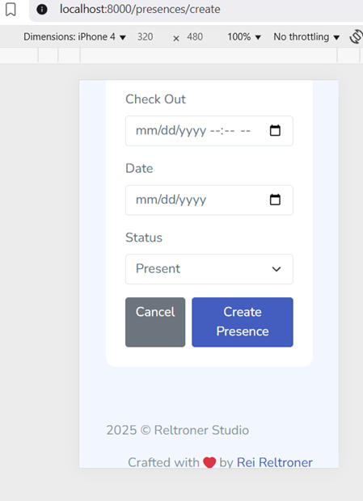
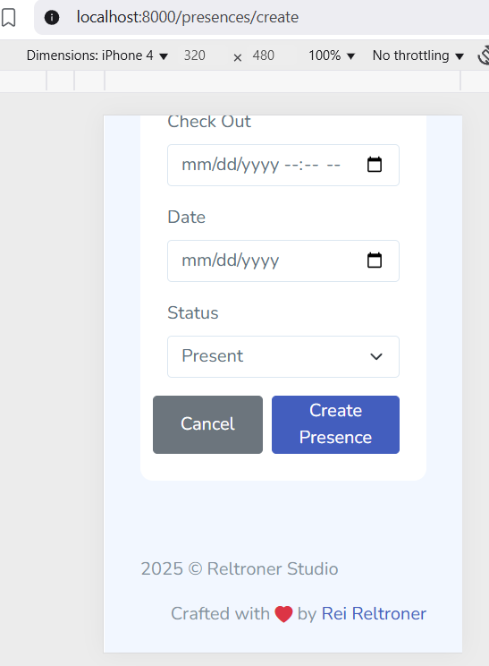

# 🐞 UI Bug: "Cancel" Button Text Not Vertically Centered (Mobile View)

### Problem

On the `/presences/create` form (mobile and desktop), the **"Cancel"** button's text was not vertically centered within the button.  
The text appeared aligned to the top, making the UI feel unbalanced and less professional.

**Observed on:**
- Mobile and desktop browsers
- Blade view: `resources/views/presences/create.blade.php`
- All Bootstrap variants (`<a class="btn">`, `<button class="btn">`)

**Screenshot (before fix):**



---

### Root Cause

- Bootstrap’s `.btn` class relies on `line-height` for centering, but if button height is increased or inconsistent due to CSS or parent containers, the text may shift off-center.
- `<a class="btn">` especially can become misaligned if height/padding is set differently from `<button>`.

---

### Solution

Apply **flexbox centering** directly to all buttons within the presence form action row for consistent vertical alignment, regardless of tag or styling.

**Patch:**

```css
.d-flex .btn {
    display: flex !important;
    align-items: center;
    justify-content: center;
    height: 44px;
    font-size: 1rem;
    padding: 0 24px;
    min-width: 120px;
}

@media (max-width: 576px) {
    .d-flex .btn {
        width: 48vw;
        min-width: unset;
        font-size: 1rem;
    }
}
````

Add this CSS to your main stylesheet or directly in your Blade with `<style>...</style>`.

---

### Result

* The **"Cancel"** and **"Create Presence"** buttons are now always perfectly vertically and horizontally centered.
* Consistent UX across devices, improved visual balance, and professional appearance.

**Screenshot (after fix):**



---

### Impact

* No more text floating at the top of action buttons.
* Quick fix, no HTML structure changes needed.
* Works for any combination of `<a>`, `<button>`, and Bootstrap `.btn` variants in action rows.

---

*If you encounter similar issues with buttons elsewhere in your app, apply the same flexbox approach for reliable centering!*
