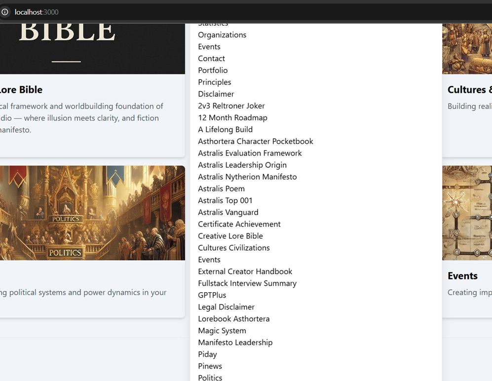

### 📁 `README.md` – Command Palette Scroll Bug & Fix

```markdown
# 🧭 Command Palette Overflow & Scroll Bug (Fixed)

This documentation describes a UI bug found in the `CommandPalette.jsx` component of the Reltroner Studio project, specifically when rendering a long list of navigation items inside a floating command dialog.

---

## 🐛 Problem

When using `cmdk`'s `<CommandDialog>`, the command palette appears centered but **cannot handle overflow content** by default. Once the number of pages grows, the command list overflows visually, pushing the dialog off-screen or making items unreachable.

**Observed Behavior:**
- List grows beyond the screen height.
- No scroll bar is present by default.
- Difficult to navigate many items on smaller viewports.

> Screenshot:  
> 

---

## ✅ Solution

We implemented a fix by **limiting the height of the list** and enabling vertical scroll.

### ✅ Patch Summary

In `CommandPalette.jsx`, apply the following to the `<CommandList>`:

```jsx
<CommandList className="max-h-96 overflow-y-auto scrollbar-thin scrollbar-thumb-gray-400 dark:scrollbar-thumb-gray-600">
```

### 💡 Explanation:
| Class Name               | Purpose                                |
|--------------------------|----------------------------------------|
| `max-h-96`               | Caps max height at ~24rem              |
| `overflow-y-auto`        | Enables vertical scrolling             |
| `scrollbar-thin`         | Makes scroll bar slimmer               |
| `scrollbar-thumb-*`      | Adds visual cue for scroll handle      |

---

## 📦 Optional Tailwind Plugin

To fully style the scrollbar (if not already enabled), install:

```bash
npm install tailwind-scrollbar
```

Then add to your `tailwind.config.js`:

```js
plugins: [
  require('tailwind-scrollbar'),
],
```

---

## 📸 Final Result

- Command palette now stays centered.
- Scroll bar appears when item count exceeds view height.
- Smooth and accessible UX for desktop power-users.

> Final View:  
> 

---

## 🧠 Bonus Tips

- Add `transition-opacity duration-200 ease-in-out` for smoother pop-up feel.
- Consider grouping commands (e.g., "Pages", "Bookmarks", "Actions").

---

Built with ❤️ by Reltroner Studio in Asthortera.
