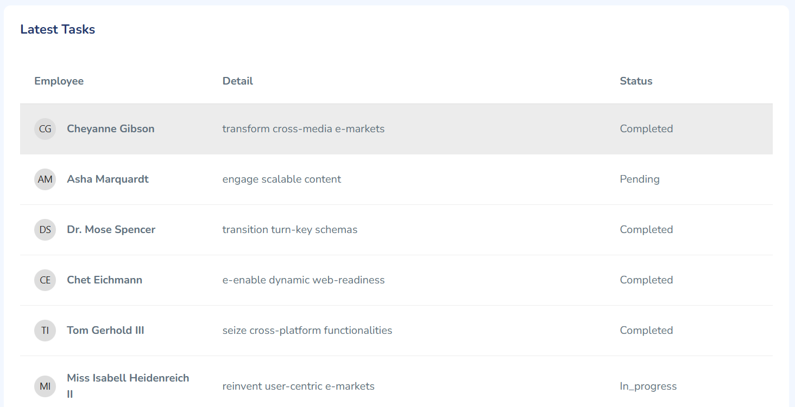

# Dashboard Table Unreadable on Mobile Devices

## Description

When viewing the "Latest Tasks" table on the dashboard via a mobile device or narrow browser, table columns are squashed and text becomes unreadable or truncated.  
Although the table is technically scrollable (via Bootstrap's `.table-responsive`), most users do not realize they need to swipe horizontally, leading to a poor user experience.

## Screenshots

| Desktop (OK)                 | Mobile (Buggy)               |
|------------------------------|------------------------------|
|  |  |

## Root Cause

- Traditional HTML tables are not inherently mobile-friendly for multiple columns.
- On small screens, each column receives too little width, so cell content is wrapped or clipped.
- Bootstrap `.table-responsive` only adds horizontal scrolling, which is unintuitive for users and does not fix readability.

## Impact

- Users on mobile devices struggle to view all data, reducing dashboard usability.
- Important data (employee, detail, status) may be hidden or unreadable without scrolling.

## Solution

### Best Practice: Hybrid Responsive Layout

**Display a traditional table on desktop/tablet; switch to a stacked card/list layout for each row on mobile.**

### Implementation Example (Blade + Bootstrap)

```blade
<!-- Desktop Table (≥576px) -->
<div class="table-responsive d-none d-sm-block">
    <table class="table table-hover table-lg">
        <thead>
            <tr>
                <th>Employee</th>
                <th>Detail</th>
                <th>Status</th>
            </tr>
        </thead>
        <tbody>
            @foreach ($tasks as $task)
            <tr>
                <td>{{ $task->employee->fullname }}</td>
                <td>{{ $task->title }}</td>
                <td>{{ ucfirst($task->status) }}</td>
            </tr>
            @endforeach
        </tbody>
    </table>
</div>

<!-- Mobile List (<576px) -->
<div class="d-block d-sm-none">
    @foreach ($tasks as $task)
    <div class="border rounded mb-2 px-2 py-2 bg-white shadow-sm">
        <div><strong>{{ $task->employee->fullname }}</strong> <span class="badge bg-light text-dark float-end">{{ ucfirst($task->status) }}</span></div>
        <div class="small text-muted mt-1">{{ $task->title }}</div>
    </div>
    @endforeach
</div>
````

* `.d-none d-sm-block` shows the table on screens ≥576px (desktop/tablet).
* `.d-block d-sm-none` shows a card/list per row on mobile, ensuring all data is visible and easily readable.

## Result

* **Desktop/tablet:** traditional table remains unchanged.
* **Mobile:** data is presented in an easy-to-read stacked card format, vastly improving the user experience.

## References

* [Bootstrap Responsive Utilities](https://getbootstrap.com/docs/5.0/utilities/display/)
* [Mobile-Friendly Table Patterns (CSS-Tricks)](https://css-tricks.com/responsive-data-tables/)

---

**Tip:**
When designing admin dashboards, always provide a mobile-optimized view for table data instead of relying only on horizontal scrolling!
