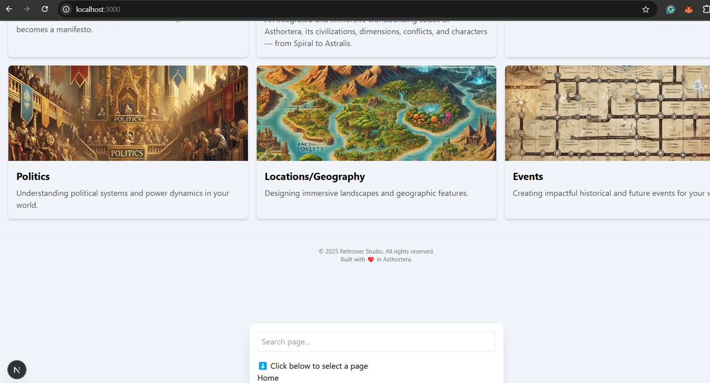

# 🛠️ Fixing UI Bugs in `CommandPalette.jsx`

This document explains a common UI bug encountered when implementing a Command Palette (⌘K / Ctrl+K) in a Next.js project using `cmdk` and `@radix-ui/react-dialog`, and how to resolve it.

## ❌ Bug: Command Palette Renders in Bottom-Left Corner

### Problem

When pressing `Ctrl+K` or `Cmd+K`, the Command Palette (`CommandDialog`) opens **in the bottom-left corner** of the screen instead of being **centered**.

This happens because by default, `CommandDialog` (built on `@radix-ui/react-dialog`) does not include any centering styles. Without explicit positioning via Tailwind or custom CSS, the dialog renders at the top-left or bottom-left, depending on the flow.

### Screenshot



---

## ✅ Solution: Add Positioning Styles

### Fix

Wrap the `CommandDialog` in a container that centers it:

```jsx
<CommandDialog
  open={open}
  onOpenChange={setOpen}
  className="fixed inset-0 flex items-center justify-center z-[9999] px-4"
>
  <div className="w-full max-w-lg bg-white dark:bg-gray-800 rounded-xl shadow-xl border dark:border-gray-600 p-4">
    ...
  </div>
</CommandDialog>
```

### Explanation

- `fixed inset-0`: Occupies the entire viewport.
- `flex items-center justify-center`: Vertically and horizontally centers the dialog.
- `z-[9999]`: Ensures it's above other elements like navbar or modals.
- `max-w-lg w-full px-4`: Keeps it responsive and visually appealing on both desktop and mobile.

---

## ⚠️ Accessibility Warning: Missing `<DialogTitle>`

Another error you may encounter:

```bash
Error: `DialogContent` requires a `DialogTitle` for the component to be accessible for screen reader users.
```

### Fix

Use the `VisuallyHidden` component to keep screen reader compatibility without showing the title:

```jsx
import { DialogTitle } from '@radix-ui/react-dialog';
import { VisuallyHidden } from '@radix-ui/react-visually-hidden';

<VisuallyHidden>
  <DialogTitle>Command Palette</DialogTitle>
</VisuallyHidden>
```

---

## 💡 Bonus: Keyboard Shortcut

Enable global shortcut:

```js
useEffect(() => {
  const down = (e) => {
    if ((e.key === 'k' && (e.metaKey || e.ctrlKey))) {
      e.preventDefault();
      setOpen((open) => !open);
    }
  };

  document.addEventListener('keydown', down);
  return () => document.removeEventListener('keydown', down);
}, []);
```

---

## 🧠 Summary

| Issue                | Fix                                                                 |
|---------------------|----------------------------------------------------------------------|
| Dialog opens bottom | Add `flex items-center justify-center` to center on screen           |
| Missing `DialogTitle` | Add `<DialogTitle>` wrapped in `<VisuallyHidden>` for accessibility |
| Not responsive       | Use `w-full max-w-lg px-4` for responsiveness                        |

---

## 📁 Related File

```
components/
  └── CommandPalette.jsx
```

Make sure `cmdk`, `@radix-ui/react-dialog`, and `@radix-ui/react-visually-hidden` are installed.

```bash
npm install cmdk @radix-ui/react-dialog @radix-ui/react-visually-hidden
```
