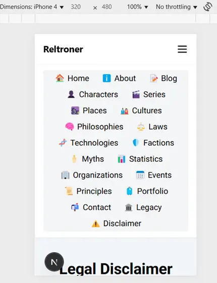

# 📋 Mobile Navbar and Desktop Navbar Separation with TailwindCSS

## Problem Description

Previously, both the desktop `Navbar` and mobile `MobileNavbar` were rendered together without clear separation based on screen size.  
This caused redundancy, confusion, and layout issues especially when switching between mobile and desktop views.

The goal was to **cleanly separate** the navigation bars:
- `MobileNavbar` for **mobile devices**.
- `Navbar` for **desktop devices**.
- Without deleting or merging both components into one.

> Screenshot:  
> 

## Solution

✅ **Render MobileNavbar and Navbar separately inside the layout**, using TailwindCSS utility classes to control visibility based on screen size.

## Updated `<body>` Structure

```jsx
<body className="bg-slate-100 text-black dark:bg-gray-900 dark:text-white">
  <GoogleAnalytics />
  <MobileNavbar />
  
  <header>
    <CommandPalette />
    
    {/* Desktop Navbar: Visible only on md+ screens */}
    <div className="hidden md:block">
      <Navbar />
    </div>
  </header>

  <main className="py-5 grow">
    {children}
  </main>

  <footer className="border-t pt-4 pb-6 text-center text-xs text-gray-500">
    <a href="/blog/for-recruiters" className="text-blue-500 hover:underline">
      For Recruiters & Collaborators ↗
    </a>
    <br />
    © {new Date().getFullYear()} Reltroner Studio. All rights reserved.
  </footer>
</body>
```

---

## Key Changes

| Component | Behavior |
|:--|:--|
| `MobileNavbar` | Always rendered but intended for mobile (optimized inside component). |
| `Navbar` | Wrapped with `hidden md:block` so it only appears on screens `md` (≥768px) and above. |
| `CommandPalette` | Always rendered, regardless of device size. |
| `GoogleAnalytics` | Always active for tracking. |
| `footer` | Always displayed at the bottom, consistent across all devices. |

---

## TailwindCSS Utility Classes Used

| Class | Purpose |
|:--|:--|
| `hidden` | Hide the element by default. |
| `md:block` | Display the element as `block` starting from `md` screen size (≥768px). |
| `bg-slate-100 dark:bg-gray-900` | Light and dark mode backgrounds. |
| `text-black dark:text-white` | Adaptive text color for light and dark modes. |
| `grow` | Allows the `<main>` to grow and fill available vertical space. |

---

## Final Result

- 🖥️ **Desktop** view will only show the **desktop `Navbar`**.
- 📱 **Mobile** view will show the **mobile `MobileNavbar`**.
- ✅ Fully responsive without breaking the user experience.
- ✅ Clean separation of responsibilities between desktop and mobile navigation.

---

# ✅ Status

- [x] Implemented correct navigation separation
- [x] Optimized TailwindCSS responsive behavior
- [x] Improved user experience across devices
- [x] Ready for GitHub commit and push

---
