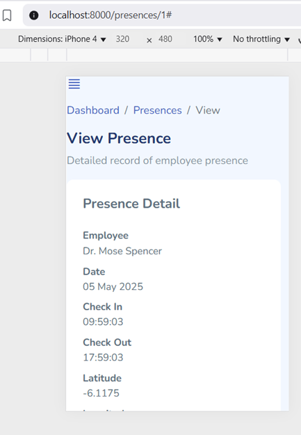
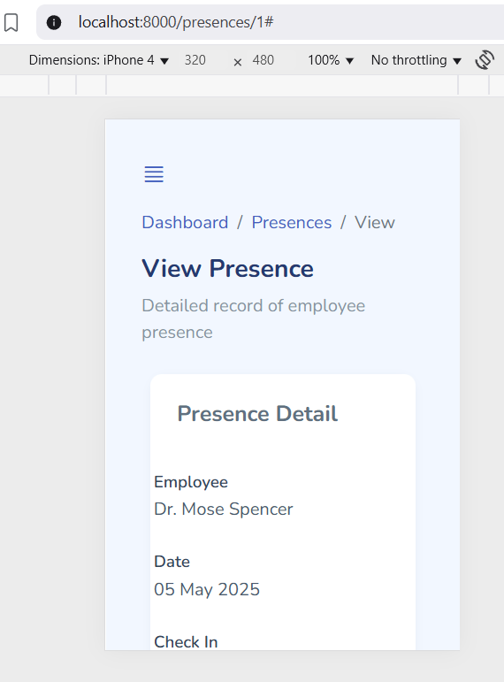

# 🐞 Mobile UI Bug: Presence Detail Card Flush to Left/Top Edge

### Problem

When viewing a single Presence record (`/presences/{id}`) on mobile devices, the detail card (showing employee, date, check-in/out, map, etc.) was rendered **flush to the left and top edges** of the screen. This led to poor readability and a cramped appearance, breaking the visual consistency of the dashboard.

**Observed on:**  
- Mobile viewports (≤576px)
- iPhone 4/5/6/SE emulator
- All modern browsers

**Screenshot (before fix):**



### Root Cause

- The parent section and card had no horizontal or top padding/margin in mobile view.
- The Bootstrap grid and card system defaults to no extra gutter/padding on small screens unless explicitly set.
- The default `.card-body` padding was insufficient, and no external spacing was applied to the card.

### Solution

- **Added custom CSS for mobile breakpoints:**
  - Gave the parent `<section>` `.presence-section` class a small `padding` (top/bottom/left/right) for mobile screens.
  - Added margin to the `.card` itself on mobile, so it does not touch the viewport edge.
  - Increased padding within `.card-body` for extra comfort on small screens.
  - Forced the `<dl>` to single-column layout on mobile for easier reading.
- **Kept desktop/tablet experience unchanged.**
- **Ensured embedded Google Maps remain fully responsive.**

**Screenshot (after fix):**



### Example Patch

```css
@media (max-width: 576px) {
    .presence-section {
        padding: 10px 6px 18px 6px;
    }
    .presence-detail-card {
        margin: 0 2px;
        border-radius: 16px;
        box-shadow: 0 2px 8px rgba(100,120,140,0.08);
    }
    .card-body {
        padding-left: 15px !important;
        padding-right: 15px !important;
    }
    .presence-detail-dl dt,
    .presence-detail-dl dd {
        float: none;
        width: 100%;
        text-align: left;
        margin-bottom: 2px;
        padding: 0;
    }
}
````

### Impact

* **Greatly improved mobile UX:** Card is always centered, never flush to the edge.
* **Consistent design:** Matches the look and feel of the rest of the app.
* **Code maintainability:** Solution uses clean, targeted CSS without JS hacks or layout overhauls.

---

*If you encounter similar "flush-to-edge" bugs on other detail cards, apply the same pattern: use padding/margin on the parent and card, and ensure inner content adapts to small screens.*
