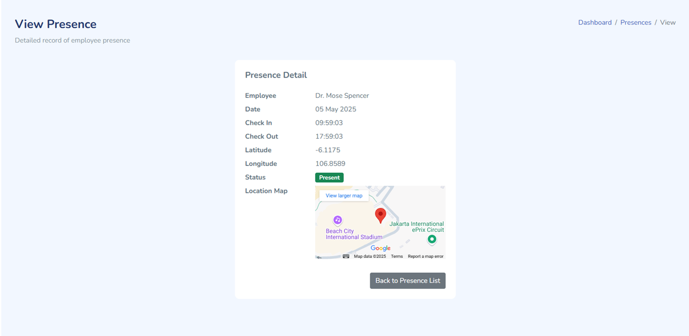
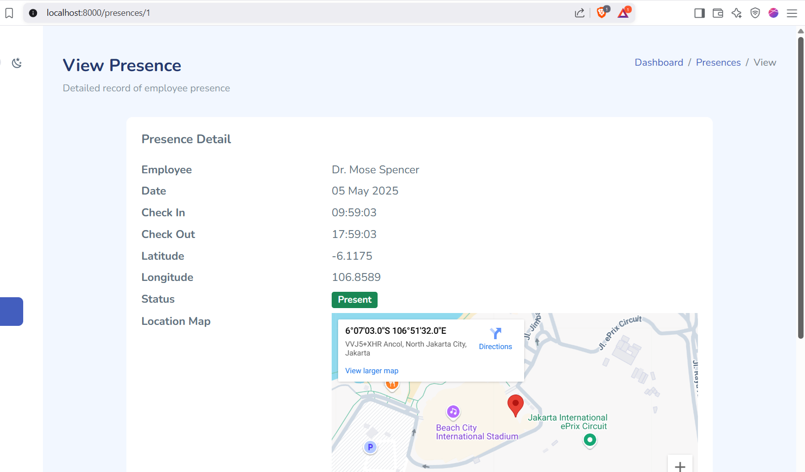

# 🐞 UI Bug: Presence Detail Card Too Narrow on Desktop

### Problem

The **Presence Detail** card at `/presences/{id}` was rendered at a fixed narrow width (max 520px) on all devices.  
While this looks comfortable on mobile, it makes the card appear awkwardly thin and cramped on larger desktop screens—especially when displaying multi-column data and embedded maps.

**Screenshot (before fix):**



### Root Cause

- The card’s max width was fixed at `520px` for all breakpoints.
- No responsive adjustment for larger (`lg`, `xl`) desktop screens.
- Card content (columns, map, and large numbers) does not have enough horizontal space.

### Solution

- Applied a **responsive CSS rule**:  
  - Keep `max-width: 520px` for mobile and tablet screens.
  - On desktop (`min-width: 992px`), increase the max width (e.g. `max-width: 760px` or `800px`).
- Optional: Increased `font-size` for desktop to further improve readability.

**Code Example:**

```css
.presence-detail-card {
    max-width: 520px;
}

@media (min-width: 992px) { /* Desktop/Large screens */
    .presence-detail-card {
        max-width: 760px; /* Or 800px, as desired */
    }
    .presence-detail-dl dt,
    .presence-detail-dl dd {
        font-size: 18px;
    }
}
````

**HTML structure:**

```blade
<div class="d-flex justify-content-center">
    <div class="card presence-detail-card w-100">
        <!-- Card content here -->
    </div>
</div>
```

**Screenshot (after fix):**



### Impact

* **Improved UX on desktop:** Card is much wider and more readable, no longer cramped.
* **Consistent mobile view:** No regression or loss of usability on small screens.
* **Professional feel:** Details, map, and actions now look balanced and comfortable.

---

*Tip: You can adjust the max-width in the desktop media query as needed, or use other breakpoints for further fine-tuning.*

