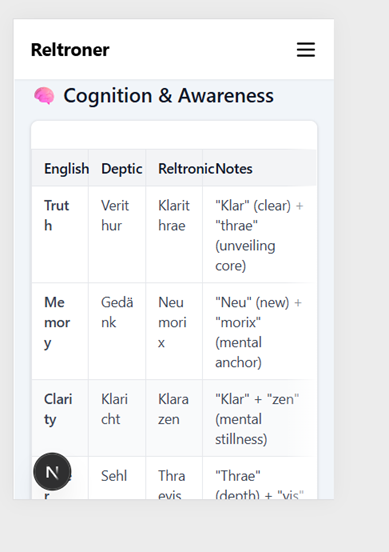
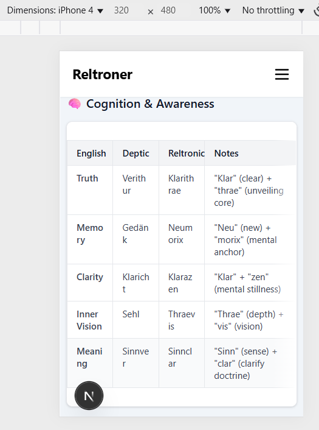

# Responsive Table Font Size & Wrapping Bug (Next.js + Tailwind)

## Issue

On the `/cultures/crosswalk-dictionary-reltronic-deptic` page, which uses a responsive table for a multi-language dictionary, the following issues were observed on small mobile screens (e.g. iPhone 4/SE):

- **Font too large for table on small screens:**  
  The table header and cell text use the default font size (`text-sm`), causing long words (e.g. "English", "Reltronic") and cell values to wrap awkwardly, making the table less readable and unprofessional on 320px screens.
- **Horizontal overflow and layout breakage:**  
  Despite using `overflow-x-auto` and `min-w-[560px]`, the large font and excessive padding made horizontal scrolling less effective; the table felt "cramped" and visually inconsistent.

## Screenshots

| Problematic Wrapping | Expected Result |
|----------------------|----------------|
|  |  |

## Solution

- **Explicitly set font size to `text-xs` on the page root**:  
  Added `text-xs sm:text-sm` to the main container, ensuring the smallest base font on mobile while preserving normal size on larger screens.
- **Reduce table cell padding**:  
  Changed from `px-3` to `px-2` for tighter cell padding.
- **Limit heading size**:  
  Used `text-base sm:text-lg` for section headings to keep visual hierarchy without overwhelming mobile.
- **Kept `table-fixed` for even column sizing**:  
  This prevents columns from shrinking below readable width.

### Code Example (Patch)

```jsx
<div className="prose dark:prose-invert max-w-3xl mx-auto px-2 sm:px-6 pt-8 pb-16 sm:pt-12 text-xs sm:text-sm">
  {/* ... */}
  <table className="w-full table-fixed border text-xs sm:text-sm">
    <thead>
      <tr>
        <th className="border px-2 py-2 w-1/4">English</th>
        <th className="border px-2 py-2 w-1/4">Deptic</th>
        <th className="border px-2 py-2 w-1/4">Reltronic</th>
        <th className="border px-2 py-2 w-1/2">Notes</th>
      </tr>
    </thead>
    {/* ... */}
  </table>
</div>
````

## Result

* Table content is now readable and professional on very small devices (e.g. iPhone 4).
* No awkward word wrapping or broken layout.
* Layout adapts cleanly with `text-sm` for tablets and desktop.

## Credits

* Thanks to [Reltroner Studio](https://reltroner.com) for reporting and iteratively debugging the bug via mobile device simulation.
* Solved in June 2025.

---

**Pro Tip:**
Always test your table-heavy pages in mobile device simulators (320px, 375px width), not just on desktop!
